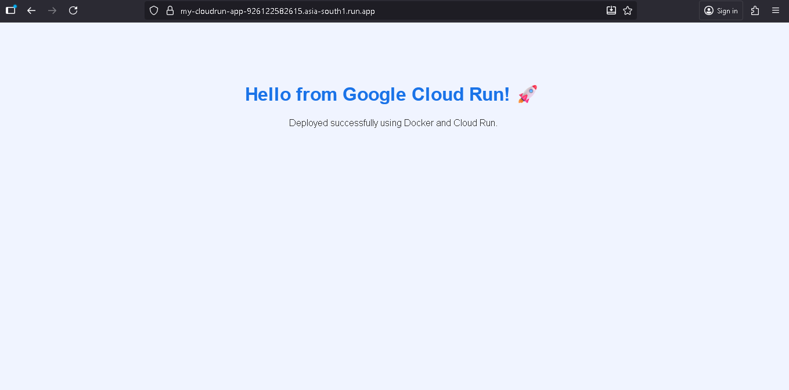

build docker image using this command 

gcloud builds submit --tag gcr.io/my-gcp-learning-474617/my-cloudrun-app

replace your own project id in this command 
 
follow these command to deploy your app on google cloud run

build cloud run service using these command 

gcloud run deploy my-cloudrun-app \
  --image gcr.io/my-gcp-learning-474617/my-cloudrun-app \
  --platform managed \
  --region asia-south1 \
  --allow-unauthenticated

